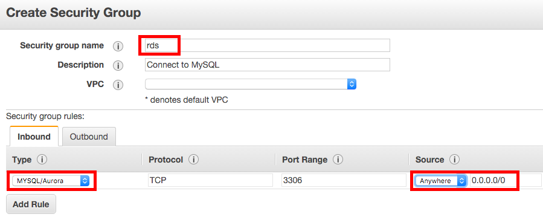

[Amazon Web Services](http://aws.amazon.com) (AWS) is a platform that offers a bewildering array of cloud computing services. Among their many products is the [Relational Database Service](https://aws.amazon.com/rds/) (RDS) which gives users the ability to quickly deploy virtual computers (called instances) to house databases in the cloud. The specifications (number of cores, RAM, and storage) of an instance can be tailored to the size of the database and number of users, and AWS charges an [hourly rate](https://aws.amazon.com/rds/pricing/) that depends on the computing power of the instance. 

The diversity and flexibility of AWS makes it extremely powerful; however, it also makes simple tasks daunting and confusing. This document will focus on a single, well-defined goal: setting up MySQL Server on an AWS RDS instance and migrating an existing database to the cloud. The only prerequisite is an AWS account, which you can [sign up for](http://aws.amazon.com) if you haven't already. A credit card is required to sign up, but you will only be charged for computing time you use, and Amazon offers an excellent [free tier](https://aws.amazon.com/free/) that is suitable for small databases.

# Deploying an RDS Instance

Log in to the [AWS Console](console.aws.amazon.com) and select the region appropriate for your location from the drop down on the top right.

## Creating a security group

AWS [security groups](http://docs.aws.amazon.com/AWSEC2/latest/UserGuide/using-network-security.html) act as virtual firewalls that control remote access to instances. They determine the range of IP addresses that can connect to an instance and what services (e.g. SSH or MySQL Server) will be available for that instance. An RDS instance should only provide access to MySQL Server.

To set this up, from the AWS Console, click on the EC2 icon under *Compute*.


Then select *Security Group* from the left panel and click the *Create Security Group* button, give the new security group a name (e.g. `rds`), and add the rule: 

- Type: **MYSQL/Aurora**; Source: **Anywhere**



Note that I've opened this instance to connections from any IP address. If security was a major concern we could create rules with specific IP addresses for each user; however, this significantly increase the work required to configure and manage the database.

## Launching the instance

To launch an RDS instance, return to the main AWS Console and click on the RDS icon under *Database*.


Next select *Instances* on the left panel, then click the *Launch DB Instance* button. You'll now proceed through 4 pages of settings for setting on the instance.

### Step 1: Select Engine

First you'll need to choose a database engine to work with. To launch a MySQL instance, click the MySQL tab, then click the *Select* button.


### Step 2: Production?

This step asks whether you want create a production or test database. Production databases have higher performance, but also higher cost. Since the KRSP database is small, with few users, a test database *should* meet the performance requirements. Therefore, I suggest initially using a test database and only switching to a production database if performance becomes an issue.


### Step 3: Specify DB Details

On this page you'll enter specific details for the RDS instance you're creating. In the *DB Engine Version* dropdown select the most current version of MySQL Server (5.7.10 at the moment). The *DB Instance Class* specifies the RAM and cores you want for the instance. The first choice in the dropdown (`db.t2.micro`) is the free tier and should be suitable for the KRSP database. Again, this can be changed to a more expensive tier if performance is an issue. Select No for *Multi-AZ Deployement* and 5GB of storage.


In the lower section of this page you should set the name of the instance to `krsp` and pick a username and password for the master user. This is the user that will have full permissions over the database and will create other users as needed. Therefore it's important to choose a secure password, and I suggest picking a generic username (e.g. `root`) rather than one specific to a person (e.g. `matt`).


### Step 4: Configure Advanced Settings

Here you'll configure the advanced settings, most which can be left as the defaults. To enable remote access to the instance, you will need to set the *VPC Security Group* to the security group you created at the start of this tutorial. In the *Database Name* field enter `krsp` to instruct AWS to create a blank database with this name when the instance is created.


Finally, RDS will automatically backup the database according to a user-defined schedule. Since the KRSP database is mostly static, backups are of minimal importance. Set this field to 0 to disable backups or, to be a bit more careful, choose a large number such as 30 days.


## Instance address

Now that you've created an instance you'll need the address so you can connect remotely. Return to the *RDS Dashboard* and click *Instances* in the left panel. Then click on instane you just created. *Endpoint* should be a URL ending in `rds.amazonaws.com`, this is the address that you'll use to connect to the remote MySQL database you've just created.


# Managing MySQL Users and Permissions

MySQL Server controls access through a list of users, each with a specified host (i.e. host name or IP address) and set of permissions. A given user can only access the database from the specified host For example, if a user's host is set to `localhost`, then they will be unable to connect remotely. Conversely, if their host is set to `example.com` then will be unable to connect from any host other than `example.com`. Furthermore, each user is given permissions for what they are allowed to do. For example, some users may only be able to `SELECT` from tables while others may be able to `MODIFY` or `DELETE`. The master user (`root` in this tutorial) specfied when creating the instance can connect from any location and has all permissions.

While logged into MySQL Server at the root user, the commands for creating a new user and granting permissions is:

```sql
CREATE USER newuser@'localhost' IDENTIFIED BY 'password';
GRANT SELECT ON sakila.* TO newuser@'localhost';
FLUSH PRIVILEGES;
```

Let's break this down:

- The first statement creates a new user with username `newuser` and password `password`. 
- In the first statement, the `@'localhost'` piece specifies that the user can only connect while logged on to the instance via SSH. `localhost` can be replaced with any host (e.g. `192.168.1.1` or `www.example.com`). In addition, the `%` symbol can be used as a wildcard, for example `%.example.com` allows connections from any host on the `example.com` domain. To allow a user to connect from anywhere, use `newuser@'%'`; however, note that there are security risks associated with opening up access from any host.
- The second statement grants `SELECT` privileges to `newuser@'localhost'`. To grant other privileges list them seperated by commas (e.g. `SELECT, INSERT`). Refer to the [MySQL documentation](http://dev.mysql.com/doc/refman/5.7/en/grant.html) for a full list of privileges, but the most common are:
    - `ALL PRIVILEGES` all privileges, except `GRANT OPTION`
    - `CREATE` user can create new tables
    - `DROP` user can delete tables and databases
    - `DELETE` user can delete rows from tables
    - `INSERT` user can add new rows to tables
    - `SELECT` user can read data from tables
    - `GRANT OPTION` user can grant priviliges to other users
- In the second statement, `sakila.*` specifies that the privileges granted apply to all tables within the sakila schema. This allows different priviliges to apply to different sets of tables. A specific table can be referenced with `sakila.film`; to grant privileges on all tables use `*.*`.

To list all existing users, run the following query:

```sql
SELECT user, host FROM mysql.user ORDER BY user, host;
```

To change an existing password for the currently logged in user, run

```sql
SET PASSWORD = PASSWORD('newpassword');
```

and to change the password for any user (e.g. `matt@'%.example.com'`), run the following while logged in as `root`

```sql
SET PASSWORD FOR matt@'%.example.com' = PASSWORD('newpassword);
```

### Allowing remote connections to MySQL

By default, remote access to MySQL Server is disabled for security reasons. To enable remote access you'll need to change the MySQL configuration file `/etc/mysql/my.cnf`. Log on to the instances via ssh, then run the following command to open the file for editing:

```bash
sudo nano /etc/mysql/my.cnf
```

Now, scroll down until you see the line `bind-address = 127.0.0.1` and comment it out by placing a `#` at the start of the line. Now save the changes (`Ctrl-O`) and exit (`Ctrl-X`). Finally, restart MySQL with

```bash
sudo /etc/init.d/mysql restart
```

### Best practices for the KRSP database

Working under the assumption that the KRSP database does not contain highly sensitive data and that access should almost always be read only, I suggest the following best practices for setting up users and permissions for remote access:

1. Each user of the database should have their own username and password; no sharing of login credentials. Where possible, use the a person's 2-3 letter observer code as their username (e.g. `abc`).
2. All users requiring remote access should only be granted `SELECT` privileges on all tables and, for simplicity, should be allowed access via any host.
3. Accounts should be created with a temporary password that will immediately expire. The new user should be instructed to login as soon as possible and will need to change their password to something more secure with `SET PASSWORD = PASSWORD('newpassword');`.
4. As people leave the project their access should be revoked using `DROP USER abc@'%';`.

With these rules in mind, setting up a new user would proceed as follows:

```sql
CREATE USER abc@'%' IDENTIFIED BY 'temppassword';
GRANT SELECT ON krsp.* TO abc@'%';
ALTER USER abc@'%' PASSWORD EXPIRE;
FLUSH PRIVILEGES;
```

Here the third line ensures the new user will have to change their password immediately. This will require logging in from the command line, which is covered below.

In addition to these remote users, the KRSP database will require some administrators who can manage other users and make changes to the tables, for example add new data at the end of a field season. This should be a very small subset of people and administrator privileges should only be allowed when connected from `localhost`, this ensures that the user must connect via SSH using their key pair first, which provides much better security.

To add user `abc` as an administrator, run the following queries either at `root` or another administrator:

```sql
CREATE USER abc@'localhost' IDENTIFIED BY 'password';
GRANT ALL PRIVILEGES, GRANT OPTION ON *.* TO abc@'localhost';
FLUSH PRIVILEGES;
```

Note that username `abc` has been used both for the remote user and for the local administrator. MySQL Server will distinguish them based on their host, so that administrator privileges will only be allowed when `abc` logs on via `localhost` after SSHing into the DB2 instance.


# Configuring the EC2 instance

Now that your instance is up and running, it's time to configure it to your needs. In particular, you'll need to configure MySQL Server to allow remote access.

## Connecting to the EC2 instance

The configuration process will require remotely logging in to the instance with SSH. Open a terminal window and enter the following command, making sure to substitute in the correct path to the private key (i.e. `.pem` file) on your local machine and the public DNS of your instance, which is available via the *Instances* page in the *EC2 Console*.

```bash
ssh -i ~/aws.pem ubuntu@ec2-52-35-107-41.us-west-2.compute.amazonaws.com
```

If this doesn't work and you get an error that looks something like this:

```
@@@@@@@@@@@@@@@@@@@@@@@@@@@@@@@@@@@@@@@@@@@@@@@@@@@@@@@@@@@
@         WARNING: UNPROTECTED PRIVATE KEY FILE!          @
@@@@@@@@@@@@@@@@@@@@@@@@@@@@@@@@@@@@@@@@@@@@@@@@@@@@@@@@@@@
Permissions 0640 for 'aws.pem' are too open.
It is required that your private key files are NOT accessible by others.
This private key will be ignored.
Load key "aws.pem": bad permissions
Permission denied (publickey).
```

You need to change the permissions for your private key so other users can't access it. To do this run the following command, making sure to use the correct path to your `.pem` file.

```bash
chmod 400 ~/aws.pem
```

Then run the above `ssh` command. Note in the `ssh` command that you've connected to the instance as user `ubuntu`. This is the default SSH user on Ubuntu-based EC2 instances. The user `ubuntu` has passwordless `sudo` ability (i.e. can run commands as a super user without the need to enter a password); however, `ubuntu` must login in the using a key pair. This is the best practice for security recommended by Amazon.

## Improve MySQL security

In the process of deploying this EC2 instance, we provided a script that installed MySQL with a dummy `root` user password "root". In the interest of security, you should run `mysql_secure_installation`, which will prompt you to change your password and make a variety of security improvements to default MySQL installation. Run the following while logged into the instance via SSH. When prompted for your current root password, enter "root", then answer provide a new (and better) root password and answer yes to all prompts.

```bash
sudo mysql_secure_installation
```

## Load a sample database

To test that MySQL Server is working and provide an example database to work with, we'll install the simple [Sakila sample database](https://dev.mysql.com/doc/sakila/en/). First download this database:

```bash
cd ~
wget http://downloads.mysql.com/docs/sakila-db.tar.gz
tar -xvzf sakila-db.tar.gz
```

Now, connect to MySQL with the following command, entering your password as required.

```bash
mysql -u root -p
```

Then load the Sakila database into MySQL with:

```sql
SOURCE ~/sakila-db/sakila-schema.sql;
SOURCE ~/sakila-db/sakila-data.sql;
```


## Connecting to MySQL in the cloud

